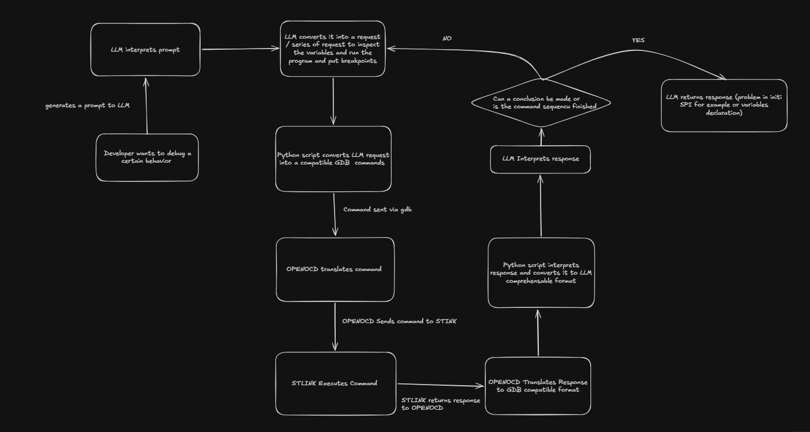
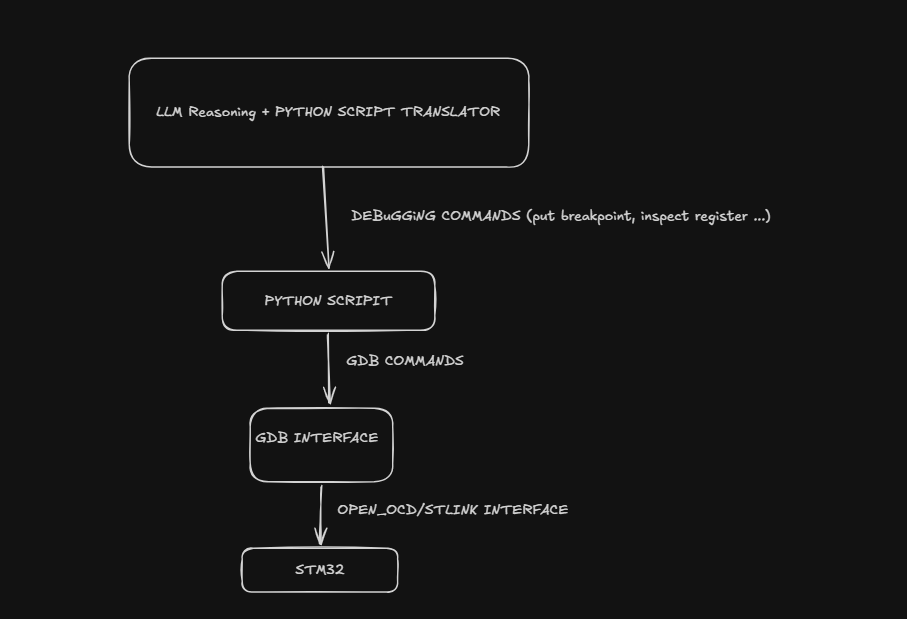
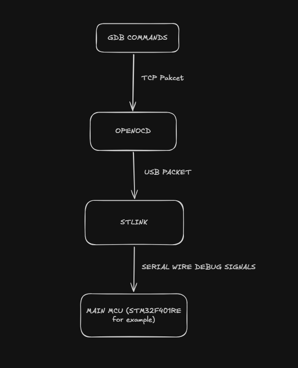

this project will be about making an AI based autonumus debugger.
## Project motivation 
we all know that LLMs now are great for code generation. but in the embedded systems world
20% of the time spent is writing and 80% of the time is code debugging
Thus i had this idea of automating the debugging step too.
## Project architecture explanation 
The project structure is still in development (since im not that good in LLM tooling)
but the core idea is that since the commands done in debugging like setting breakpoint,
Step Into, Step Over, reading stack memory, variables and registers etc can be done automatically
by seding gdb based commands and parsing the returning response and interpreting it instead of doing 
it manually in the ide 

So the execution flow will be:
 

So System architecture will be maintained simple for now:
 

## DEBUGGER STRUCTURE AND HOW IT WORKS
### GDB:
GNU debugger is a tool used to debug programs 
for example in our case arm-none-eabi-gdb which is gdb
compiled specifically to understand cortex M architecture.
So GDB provides a list of commands that we can use to 
- access program state (registers, variables, structs, stack)  
- modify in that state(we can change the variables values at runtime for example)
- stops and continues execution of the program (putting breakpoints, Stepping into, Stepping out ...)
### OPENOCD 
Open ON-Chip Debugger is a tool used to bridge the gap between the ON-CHIP debugger liek FTDI and ST-LINK and the GDB 
Thus it's role is to translate the gdb commands into a series USB commands to send it than to the stlink and vise-versa (translates USB commands to network (TCP) commands that are sent to the GDB)
### ST-LINK
it is a chip that is responsible for transforming the USB commands sent by OPENOCD to Serial Wire Debug signals sent to the main MCU to get addresses values or halts the program etc

## GDB COMMANDS SET AND EXPLANATION
we will be using the GDB MI (machine interface) commands
each GDB command sent returns a response that has 4 types:
- ^Result Record: The direct response to a command you sent (e.g., ^done, ^running, ^error).
- \* Async Exec Record: Spontaneous status changes from the target (e.g., *stopped,reason="breakpoint-hit").
- ~ Console Stream: Raw text that would normally go to a CLI screen (wrapped in quotes).
- \+ or = Status/Notify Records: Supplementary information (e.g., new thread created, library loaded).
- & Log Stream: Internal GDB error or debugging messages.

## GDB COMMAND SETS FOR AI DEBUGGING

### 1. Session Setup & Target Connection
**-file-exec-and-symbols <path.elf>**
Loads executable file and debug symbols.

**-target-select remote <host>:<port>**
Connects GDB to OpenOCD debugger (e.g., localhost:3333).

**-gdb-exit**
Terminates GDB subprocess cleanly.

### 2. Breakpoints & Watchpoints
**-break-insert <location>**
Inserts breakpoint at code location (e.g., main.c:42).

**-break-insert -h <location>**
Inserts hardware breakpoint (required for Flash execution).

**-break-watch <variable_name>**
Sets data watchpoint; stops when variable changes.

**-break-delete <breakpoint_number>**
Removes breakpoint by ID.

### 3. Execution Control
**-exec-continue**
Resumes execution until next breakpoint or fault.

**-exec-next**
Steps over current line (skips function bodies).

**-exec-step**
Steps into current line (enters function bodies).

**-exec-finish**
Executes until function returns to caller.

**-exec-interrupt**
Halts MCU immediately.

### 4. State Inspection & Variables
**-data-evaluate-expression <expression>**
Evaluates C expressions and variables.

**-stack-list-locals --simple-values**
Lists all local variables in current function.

**-stack-list-frames**
Shows stack backtrace of function calls.

**-data-list-register-values x [<reg_number>]**
Reads CPU register values (R0-R15, PC, LR, etc.).

### 5. Direct Hardware & OpenOCD Interfacing
**monitor <command>**
Passes command directly to OpenOCD. Example: `monitor reset halt`

**-data-read-memory-bytes <address> <length>**
Reads raw memory bytes from RAM or peripheral addresses.

